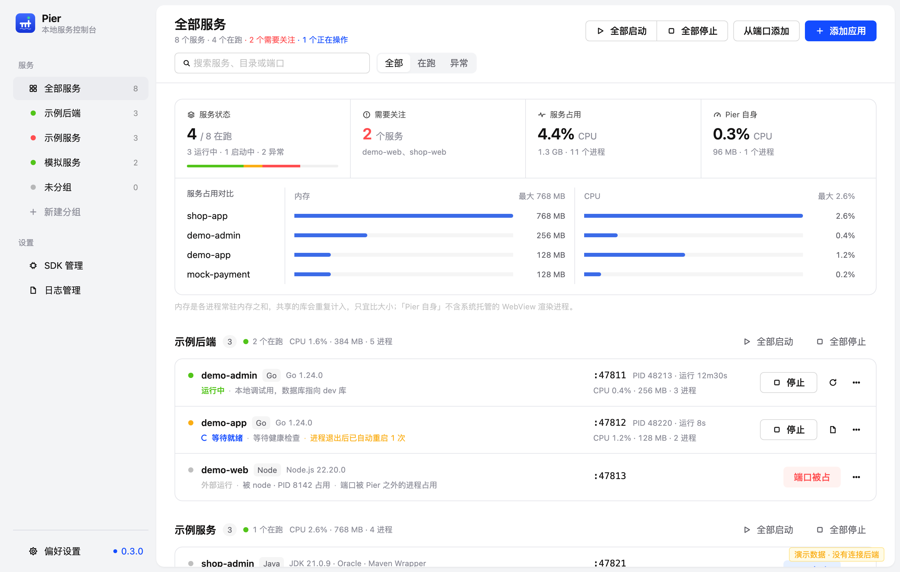
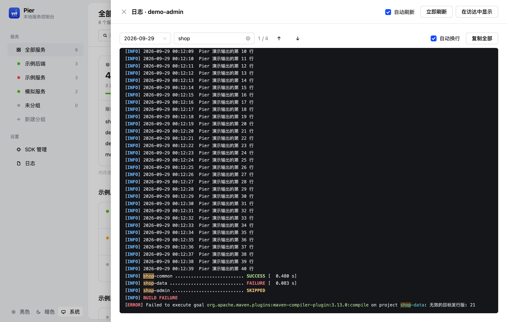
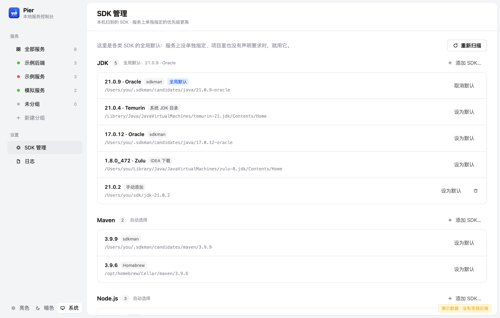
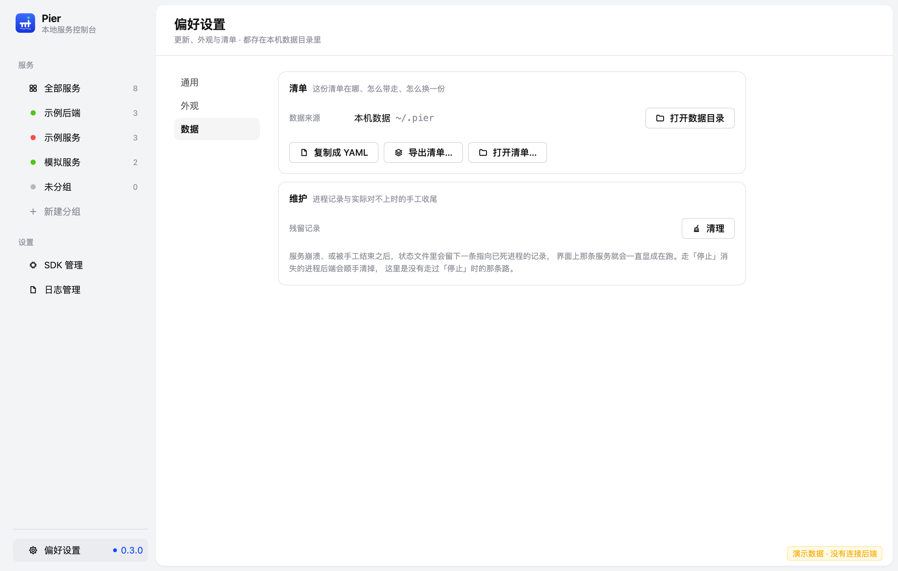
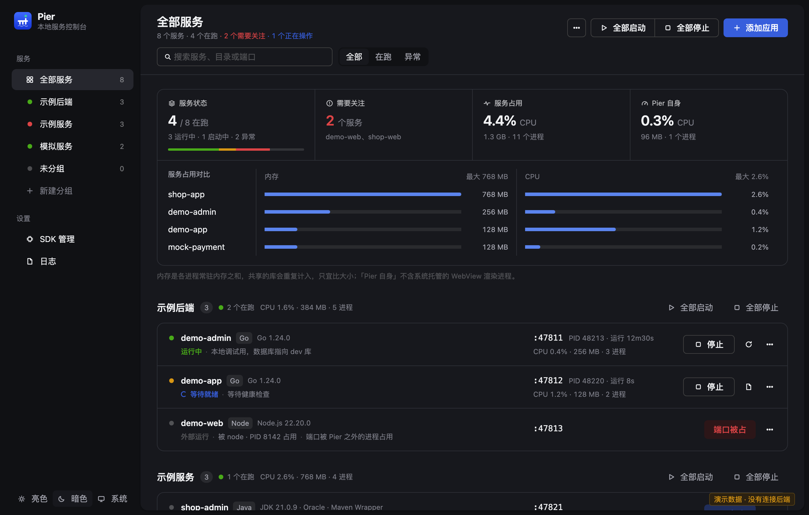

# Pier

**Start, stop and watch every local project service with one command.**

[中文](README.md) | English

Pier keeps a manifest of your services — which directory, what kind of project, how to start it,
which port it takes — and gives both you and your AI coding agent one lightweight entry point to
bring them up, read their logs and stop them. A Go CLI called `pier`, plus a GUI (one build each
for macOS, Windows and Linux). No runtime dependencies.



## Name and mark

**Pier** — the platform jutting out over the water: boats pull up, unload, and leave again. The
services that dock here are your local projects, and you can see at a glance which ones are still
running. But a pier is not part of the boats, and your services are not part of Pier — they run in
their own sessions, so closing Pier or the terminal leaves them running and still writing logs.

The icon is that pier: a deck, two piles under it, a waterline, and the rightmost pile rising past
the deck as a lamp post with a **green light** on top — the same green as the "service is running"
dot in the app. The background is a vertical gradient of the primary colour (`#3F6BFF` → `#1433D6`).
Deliberately not the letter P: a white P on blue reads as a parking sign.

The icon is **drawn in code** ([`tools/mkicon`](tools/mkicon)) rather than shipped as a bitmap, so
it can follow the palette; a bitmap would need a design tool, and a binary blob in the source hides
what changed. The sidebar mark (`Mark` in `gui/app.js`) is the same geometry in the same 200×200
viewBox — change one and you change both.

## Why

A growing share of code is written by AI, and every change wants a restart to be seen. Opening an
IDE for that is heavy; retyping a long start command every time is annoying; and when an agent
restarts services over and over, the IDE is overkill — all it wanted was "run this service again".

Real projects are rarely a single service either: a few backend modules, a dev server, a couple of
simulators — one wanting JDK 21, another JDK 8, all needing distinct ports. That information
already exists in your IDE run configurations, but it only lives inside the IDE.

Pier takes it out and turns it into a manifest plus a small always-available entry point:

- **For people**: double-click the app for a panel with start/stop, logs, and who is holding a port.
- **For agents**: `pier up <name>` and `pier logs <name>` are enough — no need to learn how the
  project boots first.

Services run as **independent processes**, not as children of Pier. Quit Pier, quit the terminal —
they keep running and keep writing logs. The next time Pier opens, it reclaims them by PID /
process group.

## Features

### Processes

- `pier up`, `pier down`, `pier restart`, with or without service names.
- Stop works at any stage: queued starts are cancelled, compiling processes are killed as a group,
  health waits are interrupted. An interrupted start never writes its state back.
- Services start in their own session (`setsid`), and the log file descriptor is inherited by the
  child — **quitting Pier never takes running services down**.
- Services can declare `depends_on` and `restart`: start follows the dependency order, stop reverses
  it, and a dependency cycle is reported while loading the manifest instead of being left to the
  sort; `restart: on-failure` means "it disappeared without going through Stop, so bring it back",
  capped at three times in ten minutes, with the panel saying how many restarts there have been.
- "Who holds this port" is resolved by **process group**, not by PID alone: the port is usually
  held by a child process, and comparing PIDs alone points at the wrong thing.
- Resource usage counts only Pier and the services it started (summed per process group), never the
  whole machine.

### Ports and origin

- `pier ports` lists what is listening right now: who opened each port, in which directory, and
  whether the manifest already claims it. The one the manifest does not know about can be adopted
  in one step — building the service from the running process beats retyping it from memory.
- "Who holds this port" walks the parent chain to report the **origin**: which editor, which
  terminal, or the Pier panel itself. When it cannot tell, it leaves the line empty rather than
  pointing somewhere wrong.
- Picking a port shows the free ones and the occupied ones side by side — whether a port is taken
  is only knowable at start time, so both lists need to be visible while choosing.

### Local HTTP API

- `pier api` serves an HTTP API on `127.0.0.1:7717`: read state, start and stop services, read logs,
  with an OpenAPI 3.1 document at `GET /openapi.json` so other tools can drive it. Print the token
  with `pier api --show-token`, replace it with `--rotate`.
- Two constraints are hard: it **binds to loopback only** (the API starts and stops processes;
  binding `0.0.0.0` would hand "what runs on this machine" to the whole LAN), and **every API call
  needs the token** — not to stop local users (they would just run `pier down`), but to stop any web
  page you happen to have open: its JS can reach `127.0.0.1`, but a cross-origin request with a
  custom header needs a preflight, and this server never answers CORS.

### Toolchains

- Service kinds: Go, Java (Maven multi-module), Node, Python, and arbitrary shell commands.
- Toolchain resolution in four steps: **per-service → project-declared → global default → whatever
  is installed**, with the reason recorded at every step (the GUI and `pier doctor` share one
  implementation). If the project asks for a version you don't have, Pier still picks a usable one
  and says so.
- Installed SDKs are discovered by scanning known install locations, not through `PATH`: an app
  launched from Finder only has `/usr/bin:/bin`, so `lookPath` would report nothing. For Go, the
  toolchain Go itself downloads into `~/go/pkg/mod/golang.org/toolchain@*` counts too.
- The "SDKs" page lets you add any directory by hand and set a global default per language.

### Logs

- One directory per service, one file per day: `logs/<service>/<date>.log`, kept for 14 days.
- A run crossing midnight keeps writing the same file — one run, one log.
- Files are appended to; "this run only" is provided by a start marker plus trimming.
- The GUI can browse past days, follow new output, search within the log (⌘F) with highlights,
  copy everything, toggle wrapping, and render ANSI colors with the terminal palette.
- Cleaning skips services that are currently running: the log fd belongs to that independent
  process, so deleting the file would only unlink it and free the space on exit.

### When something breaks

- The tail of the log is matched against known failures: when one is recognized you get **a reason
  and a next step** ("dependencies missing" / "run the install step in this service's directory"),
  along with the original line — "failed to start" on its own would just send you digging through
  the log, and the port number or module name only exists in that line. The GUI shows it under the
  failing row; `pier up` / `pier status` print it too.
- A system notification goes out when a service **exits unexpectedly, exhausts its automatic
  restarts, or fails to come back up**, carrying the service name, the diagnosed reason, and
  "restarted automatically N times". Nothing else notifies: not updates, not "checked and
  found nothing".
- Notifications can be turned off under Preferences → General (on by default). If one can't be
  delivered, nothing happens — a revoked notification permission or a Linux box without
  `notify-send` is not a Pier failure.

### Updates

- Pier checks GitHub Releases on startup (and every 6 hours after that); a new version puts a dot
  on the sidebar row — an auto-updater's worst failure is having checked and told nobody.
- Updating is **download, then restart into it**: the app downloads and verifies the SHA-256, and
  "Restart and install" hands over to a helper that waits for Pier to exit, swaps the files and
  brings it back. A failed download, a checksum mismatch, too little disk or a read-only install
  location all refuse to install with the reason stated — never a half-applied update. The swap is
  written to `logs/update/<date>.log`, and a failure shows up in the app on the next launch.
- When the install location can't be recognised — you built Pier from source, or installed it with
  `go install` — Pier says how that copy should be upgraded instead of guessing. Guessing wrong
  once would wreck someone's install directory.
- "Skip this version" stops the prompt for that release until a newer one appears.
- The CLI does the same: `pier update --check` only reports (exit code 10 means an update is
  available, so scripts can just read the code), `pier update` downloads and swaps. While the GUI
  is running the CLI refuses to touch anything — quit the GUI first, or use "Restart and install"
  there.

### GUI

- Two sidebar sections: **Services** (all / per group) and **Settings** (SDKs, logs); below them a
  single **Preferences** row (updates, appearance and the manifest) showing the current version,
  replaced by a primary-coloured dot and the new version number when an update exists.
- Reorder services by dragging, rename them (log directory moves along), duplicate one to edit.
- Search and an "all / running / needs attention" filter; bulk start/stop follows the current page.
- Log drawer, port occupancy (who holds it, kill it from there), and a defined way out when a
  health probe never passes.
- Preferences has three sections: general (check / download / skip, the automatic-check switch),
  appearance (light / dark / follow-system), and data. The data section says which manifest is in
  hand — paste it out as YAML for `pier.yaml`, save it to a file, or open another manifest
  read-only and switch back to local data at any time — and cleans up process records that no
  longer match reality.

The log drawer, SDK management, preferences and the dark theme (the rest are in
[docs/images](docs/images/README.md)):









### Importing existing setups

- `pier import` reads IDEA's `.idea/workspace.xml` and converts existing run configurations into
  Pier service definitions — the working directory, module and name are already correct there, and
  copying them into YAML by hand is easy to get wrong.
- `pier detect` scans a directory and reports what it finds, with suggested kinds and ports.

## Tech stack

| | |
| --- | --- |
| Language | Go 1.24, compiled to a single binary with no runtime dependencies |
| CLI | Hand-drawn tables; the interactive panel uses [bubbletea](https://github.com/charmbracelet/bubbletea) + [lipgloss](https://github.com/charmbracelet/lipgloss) |
| GUI | The system WebView ([webview_go](https://github.com/webview/webview_go): WKWebView on macOS, WebView2 on Windows, WebKitGTK on Linux) + React 18 + [antd](https://ant.design/) 5 + [htm](https://github.com/developit/htm) |
| Frontend build | **None.** The libraries are UMD builds, inlined into a single HTML document together with the styles and application code. No npm, no bundler, no CDN (offline, proxies or a blocked CDN would all leave a blank window with no way for the user to tell why) |
| Config | YAML ([yaml.v3](https://github.com/go-yaml/yaml)); the copy the GUI edits lives in the data directory |
| Data | JSON and log files under `~/.pier/` — no database, no background daemon |
| Platforms | macOS 11+ / Windows 10+ / Linux (the GUI needs GTK3 and WebKit2GTK 4.0); `./package.sh` builds all three at once |

## Install

### CLI

```bash
git clone https://github.com/zhengshangjinx/pier.git
cd pier
go build -o pier .
./pier --help
```

Put `pier` on your `PATH` and it works from any project directory. Or install it directly:

```bash
go install github.com/zhengshangjinx/pier@latest
```

### GUI

```bash
./package.sh            # one package per platform, all of it under dist/
```

| Platform | Artifact | How to install |
| --- | --- | --- |
| macOS | `Pier-<version>-macos-universal.dmg` / `.zip` | Open the `.dmg` and drag Pier into Applications |
| Windows | `Pier-<version>-windows-amd64.zip` | Unzip and double-click `install.cmd` |
| Linux | `Pier-<version>-linux-amd64.tar.gz` / `-arm64.tar.gz` | Unzip and run `sh install.sh` |

All three end up looking the same: **one Pier in your launcher, one `pier` in your terminal**, and
none of them needs admin rights. Windows installs under `%LOCALAPPDATA%\Programs\Pier`, Linux under
`~/.local`; on macOS the `.app` *is* the install — both the GUI `pier-gui` and the CLI `pier` live
inside it, and the `/Applications` alias in the `.dmg` makes the drag the whole install.

After that you never have to come back for another archive: Pier checks for updates itself
(see [Updates](#updates)). The one exception is **0.2.0 and older** — those builds predate the
updater, so getting off one takes a manual install; there is no gap after that.

On macOS the CLI sits inside the `.app`, so one symlink gives you the command:

```bash
ln -s /Applications/Pier.app/Contents/MacOS/pier /usr/local/bin/pier   # needs write access there
```

If you would rather not touch `/usr/local/bin`, put
`alias pier=/Applications/Pier.app/Contents/MacOS/pier` in `~/.zshrc` instead.

Runtime dependencies: nothing extra on macOS; the Windows GUI needs the WebView2 runtime that ships
with Windows 11 (and usually comes along with Edge on 10); the Linux GUI needs GTK3 and WebKit2GTK
4.0. The CLI needs no graphics libraries on any of them.

For headless machines and CI, `Pier-<version>-macos-universal.tar.gz` is the CLI on its own. The
Windows and Linux archives always carry both — skip `install.cmd` / `install.sh` and run
`bin\pier.exe` directly if you prefer.

For a single local build: `./build-app.sh` produces `build/Pier.app` on macOS (the CLI is inside it
too; all it needs is Go and the Xcode command line tools — `sips`, `iconutil` and `codesign` ship
with macOS; the bundle is ad-hoc signed, which is enough for local use), and
`go build -o pier-gui ./gui` does it on Windows and Linux.

## Quick start

1. Teach Pier about your projects: open `Pier.app` and add services under "All services", or use
   `pier import <project dir>` / `pier detect <project dir>`.
2. Run them:

   ```bash
   pier up              # everything
   pier up api web      # just these two
   pier status
   pier logs api -f
   pier down
   ```

3. To use a hand-written manifest instead (kept in your repo, committable, not in the data dir):

   ```bash
   pier status --config ./pier.yaml
   pier up --config ./pier.yaml
   ```

## Commands

| Command | Description |
| --- | --- |
| `pier doctor` | Check that each language toolchain resolves, and report which one was chosen and why |
| `pier detect [dir]` | Scan a directory, identify project types and suggest start commands |
| `pier import [dir]` | Read `.idea` run configurations and convert them into Pier services |
| `pier up [service...]` | Start services (all of them when no name is given) |
| `pier down [service...]` | Stop services |
| `pier restart [service...]` | Restart services |
| `pier wait <service...>` | Wait until those services are ready (`--timeout 30s`, default 180s) |
| `pier status [--json]` | List every service and its state |
| `pier ports [--json]` | List what is listening on this machine, who started it, and from which directory |
| `pier logs <service>... [-f] [--tail N]` | Show logs, several services at once if you like; `-f` to follow (one service), `--tail` for the line count |
| `pier logs --size [--json]` | Show how much disk the logs take |
| `pier logs --clean [service] [--all]` | Remove logs older than 14 days; `--all` clears everything |
| `pier ui` | Open the interactive terminal panel |
| `pier api` | Serve a loopback-only HTTP API (`--show-token` / `--rotate` / `--port N` / `--addr <host>`) |
| `pier version` | Print the version (`pier --version` means the same) |
| `pier update --check` | Check for a newer release without installing: exit code 0 up to date, 10 update available, 1 check failed |
| `pier update` | Download, verify and swap in the latest release |

Every subcommand accepts `--config <manifest>` to use a YAML manifest instead (read-only).
It goes **after** the command: a leading `pier --config …` is read as a command that does not exist.
`-h` / `--help` works on every subcommand too (`pier logs -h`), wherever it sits.

### Machine-readable output

`--json` is accepted by `status` / `ports` / `doctor` / `logs --size`, and only there;
anywhere else it is rejected outright rather than silently ignored. The fields are the ones the
GUI reads (`StateOut` and friends in `internal/panel`), whose key names are a public contract
that only ever grows. Stdout carries nothing but JSON — progress and notices go to stderr —
so `pier status --json | jq` always works.

### Exit codes

| Code | Meaning |
| --- | --- |
| 0 | Done. For `pier update --check`: already up to date |
| 1 | Not done: a service failed to start / a probe never passed / a port was taken so the service was skipped / logs were not cleaned / the manifest could not be read / unknown argument |
| 2 | Unknown command (usually a typo) |
| 10 | `pier update --check` only: a newer release exists |

For `pier up`, 0 means **every service in the manifest is running**: services skipped because
their port was taken do not count as success and are listed in their own section at the end.
`pier down` is the one exception — "not started by Pier" and "already exited" are notices with
exit code 0, since running `down` twice is supposed to be safe. `pier doctor` always exits 0:
a missing toolchain only affects the services that need it, so a script that wants to judge
should read `missing` from `pier doctor --json`.

## Manifest

```yaml
# pier.yaml
toolchain:
  java: /opt/homebrew/opt/openjdk@21   # global default per language

services:
  - name: api
    dir: ./server            # relative to the manifest, or absolute (no ~)
    kind: java               # go / java / node / python / shell; inferred from the directory if empty
    module: shop-admin       # Maven submodule
    port: 8080
    health: http://localhost:8080/actuator/health
    env:
      SPRING_PROFILES_ACTIVE: dev

  - name: web
    dir: ./web
    kind: node
    script: dev              # package.json script, default "dev"
    port: 5173
    group: frontend
    depends_on: [api]        # api starts first, and stops last
    restart: on-failure      # bring it back when it disappears without going through Stop
```

| Field | Meaning |
| --- | --- |
| `name` | Service name, also the argument to `up` / `down` / `logs` |
| `dir` | Working directory, relative to the manifest (no `~`) |
| `group` | Sidebar group; empty means "Ungrouped" |
| `note` | Free-form note shown in the panel |
| `kind` | `go` / `java` / `node` / `python` / `shell`; inferred when empty |
| `run` / `build` | Explicit run and build commands; inferred from the kind when empty |
| `module` | Maven submodule for Java services |
| `script` | package.json script for Node services |
| `port` | Port, used for status display and occupancy checks |
| `health` | Readiness probe URL. It is a **readiness signal, not a verdict**: a service that never answers it is still running, and the state falls back with an explanation once the probe times out |
| `env` | Extra environment variables |
| `toolchain` | Per-service toolchain override, taking precedence over the top level |
| `depends_on` | Services that must start first (a list). Ordering only, never a verdict: a service still starts when its dependency failed |
| `restart` | Takes one value, `on-failure`: bring the process back when it disappears without going through Stop. Empty means no automatic restart |

Java builds always pass `-DskipDocker=true -Ddocker.skip=true -Ddockerfile.skip=true -Djib.skip=true`
— local runs don't build images.

## Data directory

```
~/.pier/
├── services.json   services and groups (what the GUI edits)
├── settings.json   UI preferences (theme, automatic update checks, skipped versions),
│                   manually added SDKs, global defaults
├── state.json      process state (PID / PGID) used to reclaim services
├── update.json     what the last check found (release notes, asset name, ETag)
├── restart.lock    exclusive lock for the auto-restart sweep, so only one host sweeps
├── gui.lock        held while the GUI runs; the CLI reads it before replacing files
├── logs/<service>/<date>.log
├── logs/update/<date>.log
└── cache/
    ├── bin/        hard links used to name Node processes
    └── update/     downloaded assets, the extracted new version, and the helper's result
```

Missing files are created empty. `PIER_HOME` relocates the whole directory (the tests always set
it, so they never touch real data).

## Development

```bash
go vet ./... && go test ./... -count=1     # checks
./build-app.sh                             # build build/Pier.app
./package.sh                               # per-platform packages under dist/
tools/shoot/shoot.py /tmp/a.png 1382 880   # render the UI to a PNG (demo data)
tools/smoke-update.sh cli                  # fake install in a temp dir, then pier update on it
```

[`AGENTS.md`](AGENTS.md) (Chinese) documents the project's conventions and the reasoning behind
them — UI rules, log rules, how process names are rewritten, and why some simpler-looking
approaches don't work. Worth reading before changing code.

## License

[MIT](LICENSE). Third-party libraries and their licenses are listed in
[THIRD_PARTY_NOTICES.md](THIRD_PARTY_NOTICES.md).
