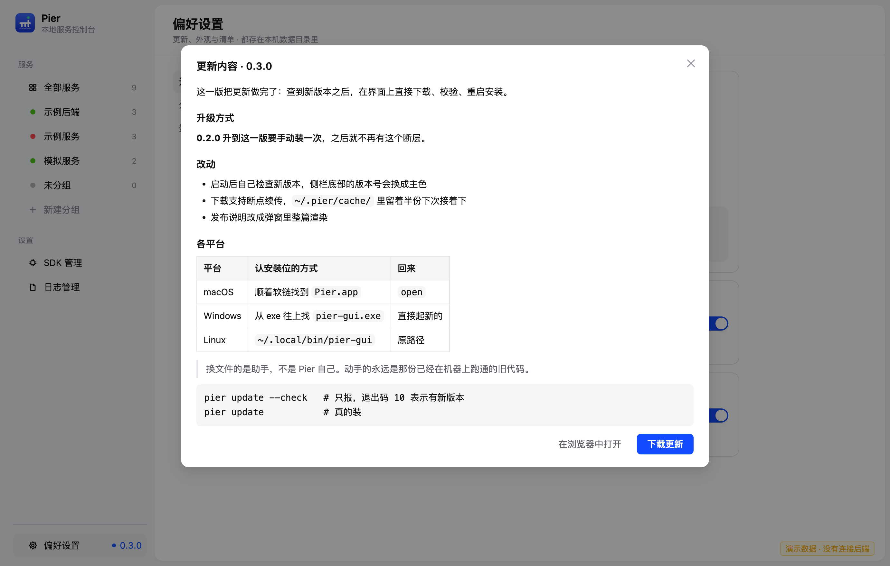

# Pier

中文 | [English](README.en.md)

**一条命令，启停本地所有项目服务。**

Pier 把「哪些目录、算什么类型、怎么起、占哪个端口」记成一份清单，之后不管是你还是 AI，
都能一条命令（或者界面上点一下）把整套服务起起来、看日志、停掉。
一个 Go 写的命令行 `pier`，外加一个图形界面（macOS / Windows / Linux 各一份），零运行时依赖。


## 名字与图标

**Pier** 是栈桥——伸进水里的那块平台：船靠上来、装卸完再开走。这里停靠的是本地服务，
一眼能看见哪几条还在跑；但栈桥不是船的一部分，服务也不是 Pier 的一部分——它们起在独立会话里，
关掉 Pier、关掉终端，在跑的服务照跑，日志照写。

图标画的就是这座栈桥：一条桥面、底下两根桩、水面，最右那根桩伸出桥面当灯杆，顶上一盏**绿灯**
——正是界面里「服务在跑」的那颗点。底色是主色（`#3F6BFF` → `#1433D6`）的竖向渐变。
刻意不用字母 P：蓝底白 P 第一眼读出来的是停车场。

图标是**用代码画的**（[`tools/mkicon`](tools/mkicon)），不是塞进来的位图——配色要能跟着一起改，
位图得开设计软件；二进制资源进了源码，也看不出改了什么。侧栏那个标记（`gui/app.js` 的 `Mark`）
是同一套 200×200 视框里的几何，改一处要改两处。

## 为什么做这个

现在很大一部分代码是 AI 在写，改完就要重启看效果。为了一次重启去打开 IDE，太重；
每次在命令行里重新敲一遍启动参数，又太麻烦；而让 AI 频繁启停服务时，开 IDE 更是小题大做
——它要的只是「把这个服务重新跑起来」。

真实的项目还常常不止一个服务：后端几个模块、前端一个 dev server、再加两个模拟服务，
有的要 JDK 21、有的要 JDK 8，端口还得错开。这些信息在 IDE 的运行配置里本来就有，
但它只活在 IDE 里。

Pier 把它们拿出来，变成一份清单加一个常驻的轻量入口：

- **对人**：双击图标就是一个面板，起停、看日志、看谁占着端口，都在一块屏幕上。
- **对 AI**：`pier up <名字>`、`pier logs <名字>` 就够了，不必先理解这个项目是怎么启动的。

服务是**独立进程**，不挂在 Pier 底下：关掉 Pier、甚至关掉整个终端，在跑的服务照跑，
日志照写；下次打开 Pier，它按 PID / 进程组重新认领回来。

## 功能

### 启停与进程

- 一条命令启动全部或指定服务：`pier up`、`pier down`、`pier restart`。
- 停止在任何阶段都可用：排队中撤销，编译 / 拉起中取消，等待就绪中停进程。
  被打断的启动流程不会再把状态写回来。
- 服务起在独立会话（`setsid`）里，日志文件句柄由子进程继承——**退出 Pier 不带走任何在跑的服务**，
  也没有 stop-on-quit。
- 服务之间可以写 `depends_on` 与 `restart`：启动顺着依赖、停止反着来，依赖成环在加载清单时
  就报出来，不留到排序去兜；`restart: on-failure` 表示「不是经『停止』消失的，就再拉起来」，
  十分钟三次为限，界面上写明重启了几次、到了上限没有。
- 依赖还可以带条件：`depends_on: [mysql:healthy]` 表示自己的进程要等 mysql 的探针通过才拉起来，
  等不到照样起（状态里写明「没有等到 mysql 就绪」，不拦住别的东西）。只写名字的那些照旧只排顺序。
- 就绪探针有三种：HTTP 地址、`tcp://主机:端口`（数据库、缓存、消息队列这些没有 HTTP 接口的）、
  `cmd: 命令`（退出码 0 就算就绪）。它是**就绪信号而不是成败判据**：没探通的服务照样在跑。
- 平时不需要的服务可以标 `manual: true`（界面上的「全部启停 → 跳过」）：`pier up` / `pier down`
  不带名字时、界面上的「全部启动 / 全部停止」都会跳过它，点名或用分组时照常启停。
  清单里躺着 mock、抓包、只在前端调试时才用的那一套是常态，标出来就不必每次手工把它们摘出去。
- 改完想自动重跑的服务写一行 `watch: true`（界面表单里的「改完重跑」）：盯着自己的目录，
  变化合并 400ms 后走一次正常重启。`true` 按类型给一套默认（Go 盯 `*.go` 与 `go.mod`，
  Java 盯 `src/main/**` 与 `pom.xml`），也可以自己点名一串模式。
  产物目录一律不看（`node_modules`、`target`、`dist`、`.git`，以及 Pier 自己的日志与 bin），
  否则编译产物一落地就把自己再重启一次。这类重启不占「自动重启」的额度，也不去启动已经停掉的服务。
- 分组不只是面板上的口径：`pier up @前端` 起的就是界面上「前端」那一页里的服务
  （`@未分组` 也行）。分组是一份点到具体几个服务的名单，标了 `manual` 的也在里面。
- 端口被谁占着按**进程组**认领：端口常握在子进程手里，只比 PID 会认错，
  界面上就会出现一个指向别处的「结束进程」。
- 资源占用只统计 Pier 自己和它起的服务（按进程组求和），不采整机。

### 端口与溯源

- `pier ports` 列出此刻正在监听的端口：每个是谁开的、在哪个目录、清单里认不认领。
  清单里没有的那条可以一键纳管——照着正在跑的进程把服务建出来，比照着记忆一笔一笔填表单准。
- 「被谁占着」会顺着父进程链往上找**启动来源**：是哪个编辑器、哪个终端、还是 Pier 面板自己。
  认不出来就留空——宁可不写，也不指一个错的地方让人白跑一趟。
- 建服务时挑端口，弹窗把「可以用的」与「已被占用的」并排摆出来：端口会不会被别的项目占着，
  只有启动的时候才知道，两边都看得见才不至于挑一个别人已经占了的号。
- 清单里那个端口被别人占着时，可以**只换这一次**：服务行的「⋯」里有「换一个端口起」，
  命令行上是对应的 `pier up api --port 0`（0 表示自己挑一个空闲的，也可以直接写一个号）。
  换的只对这次运行有效、不写回清单，界面上一直写着「清单里写的是 8080，这次用的是 8081」，
  日志头上也记着这次实际用的端口。占着它的那个进程走了之后，下一次启动自己回到清单里那个号上；
  它还没走的时候，重启接着用换后的那个——重开一次就回清单里那个被占着的端口上撞一次，
  那这个「换一个端口起」等于没换。

### 本地接口

- `pier api` 在 `127.0.0.1:7717` 起一个 HTTP 接口：读状态、启停服务、读日志，附一份 OpenAPI 3.1
  （`GET /openapi.json`），可以直接喂给别的工具。令牌用 `pier api --show-token` 打印、`--rotate` 换一份。
- 两条约束是硬的：**只监听回环地址**（这个接口能启停进程，绑到 `0.0.0.0` 等于把「在这台机器上
  跑什么」交给整个局域网），以及**每个接口都要令牌**——它挡的不是本地用户（那种人直接敲一句
  `pier down` 就行），而是浏览器里随手打开的页面：页面里的 JS 能往 `127.0.0.1` 发请求，但带
  自定义头的跨源请求要先过一次预检，而这里从不答 CORS。
  `--addr` 想换的只是**哪一个**回环地址（`::1`、`127.0.0.2` 这类），别的值当场报错——
  这条约束是代码拦的，不靠 README 提醒。

### MCP

- `pier mcp` 在标准输入输出上说 MCP（Model Context Protocol），给 Claude Code 这类
  客户端用：七个工具 `list_services` / `service_status` / `start_service` / `stop_service` /
  `restart_service` / `read_logs` / `wait_ready`，起的是与界面、`pier api` 同一批服务。
- **走 stdio，不开端口、不发令牌**：用它的进程就在本机，那条管道是客户端自己给的，
  多开一个端口就多一份要保护的东西。写进客户端配置就是一个命令：

  ```json
  { "command": "pier", "args": ["mcp"] }
  ```

- 「没等到就绪」是 `wait_ready` 的一个**答案**，不是调用失败：哪几个没到、各自卡在哪一步
  （没配探针 / 没在跑 / 到点还没探通）都写在回执里，下一步该做什么跟着分开说。
- 清单读不动也照样起来：`list_services` 会把原因一并说出来，而不是当场退出——
  客户端那边的表现是一句「连不上」，看不出是清单写错了。

### 多语言与工具链

- 服务类型：Go、Java（Maven 多模块）、Node、Python，以及任意 shell 命令。
- 工具链四步解析：**服务上指定 → 项目自己声明 → 全局默认 → 本机兜底**，
  每一步都写清楚为什么选它（界面与 `pier doctor` 共用同一份说明）。
  项目要求而本机没有的版本，照样选一个能用的，同时把差别说出来。
- 本机装了哪些 SDK 是自己扫出来的，不依赖 `PATH`：从访达双击启动的程序只有 `/usr/bin:/bin`，
  指望 `lookPath` 会看到一个空列表。Go 还认 `~/go/pkg/mod/golang.org/toolchain@*`
  （`go.mod` 要求更高版本时 go 命令自己下的那套）。
- 「SDK 管理」页可以手动添加任意目录、给每个语言设全局默认。

### 环境变量

- 清单顶层可以写一组 **`env`**，所有服务都拿到；服务自己的同名变量覆盖它。
  一组服务共用同一个数据库地址、同一套注册中心配置时，改一处就够了，
  也不会漏掉某一个服务让它连回旧地址。
- 服务目录下的 **`.env`** 自动注入，语义照 dotenv 的通行做法：只补缺（进程环境里
  已经有的不动）、值两端成对的引号去掉一层、`#` 起注释但只认整行（值里的 `#` 留着）。
  只读这一份，不去猜 `.env.local`、`.env.development` 该取哪个。写得读不动就拦住启动，
  并指到是哪份文件的哪一行。
- 值里可以写 **`${DB_HOST}`** 从「已经算好的环境」里取值，**`${PORT}`** 取这个服务
  自己的端口——启动时注入的 `PORT` 与子进程自己读到的是同一个值。没写 `$` 的值一个
  字节都不会被改；`$${X}` 表示字面的 `${X}`。
- **取不到就报错，不留空**：留一个空值，服务会带着一个看着正常、其实是空串的配置连上去。
  启动日志里会写明注入了哪些变量（只有名字）。界面在「偏好设置 · 数据」那一栏里编辑。

### 日志

- 一个服务一个目录、一天一份：`logs/<服务名>/<日期>.log`，保留 14 天。
- 跨零点不改文件名——一次运行就是一份日志，不会被午夜劈成两半。
- 文件是追加写的，「只看这一次运行」由启动标记加截断保证。
- 界面里能按日期翻历史、跟着新增内容滚动、在日志里搜索（⌘F）并高亮命中，
  还能把正在看的那一段复制走、或导出成文件（抽屉只读尾部，所以复制的是显示出来的那些），
  可以切换自动换行；ANSI 颜色按终端配色渲染。
- 清理时会跳过正在运行的服务：日志句柄握在那个独立进程手里，删掉只是 unlink，
  空间要等它退出才真的空出来。

### 出事了有人管

- 日志尾部会认一次：认得出就给你**一句原因加一句下一步**（「依赖没装」／「在这个服务的目录里
  跑一次装依赖」），并把命中那一行的原文一并摆出来——只说「启动失败」，你还得自己去日志里翻，
  而端口号、模块名这些字只在原文里有。界面挂在出错那一行下面，`pier up` / `pier status` 一起打印。
- 服务**异常退出、自动重启到上限、自动重起动不起来**时发一条系统通知，带上服务名、
  诊断出来的原因和「已自动重启第 N 次」。这三种之外一概不发：不发更新，也不发「检查过了」。
- 通知可以在偏好设置「通用」里关掉（默认开）。发不出去就什么都不做——系统里没给
  通知权限、Linux 上没装 `notify-send`，都不算 Pier 出错。

### 更新

- 启动后自己查一次 GitHub Releases（之后每 6 小时一次），有新版本就在侧栏那一行亮一颗点
  ——自动更新最怕的是「查过了，而没人知道」。
- 更新是**下载并重启安装**：界面里下完、校验过 SHA-256，点「重启并安装」，一个助手等
  Pier 退出之后把文件换掉，再把它拉回来。下载失败、校验不通过、磁盘不够、安装目录写不动，
  一律拒绝安装并说明原因，绝不换一半；换的过程写在 `logs/update/<日期>.log`，
  失败原因下次启动时会摆回界面上。
- 认不出安装位就不动手：自己从源码编的、`go install` 装的那两份，说清楚该用什么方式升级，
  不给「立即更新」这条路——猜错一次就是把用户的安装目录搞坏。
- 不想升这一版可以「跳过」，同一个版本不再提，直到有更新的版本。
- 命令行同一件事：`pier update --check` 只查不装，退出码 10 就是有新版本，脚本直接看它；
  `pier update` 下载、校验并换上。界面开着时命令行拒绝动手——先在界面里退出，
  或者用界面里的「重启并安装」。

### 界面（macOS）

- 侧栏两节：**服务**（全部服务 / 各分组）与**设置**（SDK 管理、日志管理）；底下单出一行
  **偏好设置**（更新、外观与清单），右边写着当前版本号，有新版时换成主色的圆点加最新版本号。
- 服务可拖动排序，可改名（日志目录跟着搬），可「复制一份」接着改。
- 概览那两格「服务占用 / Pier 自身」下面各带一条最近的曲线，CPU 与内存各一行：满格只说
  这一段里这个最高，绝对值仍在格子里那个数字上。
- 「全部服务」那一页可以按分组折叠，几十个服务时不用一路滚；分组页上不折叠（只有一组），
  筛选时也不折叠——搜索是「帮我找 X」，把命中的结果收在折起来的那一组里就是把它藏起来。
- 搜索认名称、目录、端口、备注与分组名；筛选用「全部 / 在跑 / 已停止 / 异常」，
  批量启停跟着当前这一页走。重开一次还停在上次那一页，窗口的大小与位置也照上次摆。
  平时不需要的服务在表单里打开「全部启停 → 跳过」，列表上挂一颗「跳过全部」的标记，
  「全部启动 / 全部停止」会绕开它——概览那一行也写着有几个这样的服务。
- 日志抽屉、端口占用（谁占着、直接结束）、健康探针未通过时的收场方式。
- 偏好设置分三栏：通用（检查 / 下载 / 跳过、自动检查开关、通知开关）、外观（亮色 / 暗色 /
  跟随系统）、数据。发布说明按原样的 markdown 渲染在弹窗里，标题、列表、表格、代码块
  都排得出来，也不会把「下载更新」顶到一屏之外。清单那一栏写着手上是哪份数据，可以
  「复制成 YAML」贴进 `pier.yaml`、导出成文件、或者打开另一份清单来用（打开的那份是只读的，
  随时能切回本机数据）；共享环境变量也在这一栏里编辑，进程记录与实际对不上时同样在这里手动收尾。
- 几套 SDK 的「将使用 X，依据 Y」与实际启动走的是同一个解析器，不是另写一份简化版。

日志抽屉、SDK 管理、偏好设置与深色主题（其余几张见 [docs/images](docs/images/README.md)）：





### 导入现成的配置

- `pier import` 读取 IDEA 的 `.idea/workspace.xml`，把里面已经调好的运行配置转成 Pier 的服务定义
  ——工作目录、模块、启动项名字都是现成的，手工抄成 YAML 极易抄错。
- `pier detect` 扫一个目录，认出里面有哪些项目、各自该用什么类型和端口。
- `pier add` 把认出来的东西直接加进清单，不必先看一遍再手抄
  ——站在项目里敲一句 `pier add` 就够了，认不出类型时用 `--kind` 与 `--run` 补上。

### 从命令行改清单

`add` / `edit` / `rm` / `group` 改的是数据目录里那份 `services.json`，
与界面上的编辑走同一套校验（`internal/manage`）：端口撞车、目录不存在、正在跑的服务不许删
都在那里拦下，在两处各写一份迟早会有一处放行。拿 `--config` 指到一份 YAML 上会被拒绝：
按约定 Pier 不改写人手写的文件（`pier status --config` 这类只读的照常能用）。

改完要**重开窗口**才看得见：界面只在启动与切换清单时读一次。

## 技术栈

| | |
| --- | --- |
| 语言 | Go 1.24，编译出单一二进制，零运行时依赖 |
| 命令行 | 自绘表格；交互式面板用 [bubbletea](https://github.com/charmbracelet/bubbletea) + [lipgloss](https://github.com/charmbracelet/lipgloss) |
| 图形界面 | 系统自带的 WebView（[webview_go](https://github.com/webview/webview_go)：macOS 用 WKWebView、Windows 用 WebView2、Linux 用 WebKitGTK）+ React 18 + [antd](https://ant.design/) 5 + [htm](https://github.com/developit/htm) |
| 前端构建 | **没有构建**：第三方库是 UMD 构建，连同样式与应用代码一起内联进一份 HTML。不需要 npm，不需要打包器，也不引 CDN（断网、代理、CDN 被墙都会让窗口打开后一片空白，而用户无从判断原因） |
| 配置 | YAML（[yaml.v3](https://github.com/go-yaml/yaml)）；界面编辑的那份存在数据目录里 |
| 数据 | 全部是 `~/.pier/` 下的 JSON 与日志文件，没有数据库，没有后台守护进程 |
| 平台 | macOS 11+ / Windows 10+ / Linux（图形界面要 GTK3 与 WebKit2GTK 4.0）；`./package.sh` 一次打出三边的安装包 |

## 安装

### 命令行

```bash
git clone https://github.com/zhengshangjinx/pier.git
cd pier
go build -o pier .
./pier --help
```

把 `pier` 放进 `PATH` 之后，在任意项目目录下都能直接用。也可以直接装：

```bash
go install github.com/zhengshangjinx/pier@latest
```

### 图形界面

```bash
./package.sh            # 按平台各打一份，产物全部落在 dist/
```

| 平台 | 产物 | 怎么装 |
| --- | --- | --- |
| macOS | `Pier-<版本>-macos-universal.dmg` / `.zip` | 打开 `.dmg`，把 Pier 拖进「应用程序」 |
| Windows | `Pier-<版本>-windows-amd64.zip` | 解压后双击 `install.cmd` |
| Linux | `Pier-<版本>-linux-amd64.tar.gz` / `-arm64.tar.gz` | 解压后 `sh install.sh` |

三个平台装完是同一个样子：**启动台/开始菜单/应用菜单里一个 Pier，终端里一个 `pier`**。
Windows 装到 `%LOCALAPPDATA%\Programs\Pier`，Linux 装到 `~/.local`，都不需要管理员；
macOS 就是那个 `.app` 本身——界面 `pier-gui` 与命令行 `pier` 都在它里面，
`.dmg` 里的「应用程序」替身拖过去就装完了。

装完之后就不用再回来找这份包了：Pier 会自己查更新（见[更新](#更新)）。唯一的例外是
**0.2.0 及更早的版本**——更新器是后来才加的，那几版里没有它，从那里升上来要手动装一次；
这一次之后就不会再有断层。

macOS 上 `pier` 在 `.app` 里面，做一次软链就有命令了：

```bash
ln -s /Applications/Pier.app/Contents/MacOS/pier /usr/local/bin/pier   # 要 /usr/local/bin 的写权限
```

不想动 `/usr/local/bin`，就把 `alias pier=/Applications/Pier.app/Contents/MacOS/pier`
写进 `~/.zshrc`。

各平台的运行时依赖：macOS 直接能跑；Windows 的界面要系统自带的 WebView2 运行时
（Win11 自带，Win10 多半也随 Edge 装好了）；Linux 的界面要 GTK3 与 WebKit2GTK 4.0。
命令行那一份哪边都不依赖图形库。

没有图形界面的机器（CI、服务器）上装 macOS 那份只有命令行的
`Pier-<版本>-macos-universal.tar.gz` 即可；Windows 与 Linux 的包里两份都在，
不跑 `install.cmd` / `install.sh`、直接用 `bin\pier.exe` 也照样能用。

只想在本机打一份也行：macOS 上 `./build-app.sh` 打包出 `build/Pier.app`（里面已经带着
`pier`；只要本机有 Go 和 Xcode 命令行工具即可，`sips`、`iconutil`、`codesign` 都是系统自带的；
生成的 App 用临时签名，自己用不需要开发者证书）；Windows / Linux 上 `go build -o pier-gui ./gui`。

## 快速开始

1. 让 Pier 认识你的项目：打开 `Pier.app`，在「全部服务」里新建服务；或者让命令行来——
   在项目目录里敲一句 `pier add`，它自己认出这是个什么项目并记下来；也可以指过去：
   `pier add ~/work/api`。现成的 IDEA 项目可以直接读它的运行配置（`pier import <项目目录>`），
   只想看看它认出了什么、一个字都不写则是 `pier detect <项目目录>`。
2. 起服务：

   ```bash
   pier up              # 全部启动（跳过标了 manual 的那些）
   pier up api web      # 只启动这两个
   pier up @前端        # 起这一组，与界面上那一页对齐
   pier status          # 看现在什么状态
   pier logs api -f     # 跟着看日志
   pier down            # 全部停掉
   ```

3. 想用一份手写的清单（不进数据目录、保存到项目里、可提交给同事）：

   ```bash
   pier status --config ./pier.yaml
   pier up --config ./pier.yaml
   ```

## 命令一览

| 命令 | 说明 |
| --- | --- |
| `pier doctor` | 检查各语言工具链能不能解析，并说明选了哪一个、依据是什么 |
| `pier detect [目录]` | 扫描目录，识别项目类型并给出建议的启动项 |
| `pier import [目录]` | 读取 `.idea` 运行配置，转成 Pier 的服务定义 |
| `pier add [目录]` | 认出一个目录里的项目并加进清单；不给目录就用当前目录，`--kind` / `--run` / `--port` 可逐项指定 |
| `pier edit <服务> <开关>...` | 改一条服务，没提到的栏目原样留着（`--port` 会连带改写探针里的端口） |
| `pier rm <服务>...` | 从清单里删掉这些服务；只删定义，项目目录里的文件一个都不动 |
| `pier group [add\|rename\|rm]` | 看有哪些分组，以及新建、改名、删掉一个分组 |
| `pier up [服务...]` | 启动服务；不带名字是「全部」（跳过标了 `manual` 的），名字前加 `@` 按分组起；`--port 0` 让点名的那个换一个端口起，只这一次 |
| `pier down [服务...]` | 停止服务；不带名字时的「全部」与 `up` 是同一份名单 |
| `pier restart [服务...]` | 重启服务 |
| `pier wait <服务...>` | 等这些服务就绪（`--timeout 30s`，默认 180s） |
| `pier status [--json]` | 列出所有服务的运行状态 |
| `pier ports [--json]` | 列出本机正在监听的端口，以及各自是谁起的、在哪个目录 |
| `pier logs <服务>... [-f] [--tail N]` | 查看日志，可一次看几个；`-f` 跟随（一次一个），`--tail` 换行数 |
| `pier logs --size [--json]` | 看日志占了多少磁盘 |
| `pier logs --clean [服务] [--all]` | 清理超过 14 天的日志；`--all` 清空 |
| `pier ui` | 打开终端里的交互式面板 |
| `pier api` | 起一个只服务本机的 HTTP 接口（`--show-token` / `--rotate` / `--port N` / `--addr <回环主机>`） |
| `pier mcp` | 在标准输入输出上说 MCP，把启停与日志交给 AI 客户端 |
| `pier version` | 显示版本号（`pier --version` 同一个意思） |
| `pier update --check` | 查一下有没有新版本，只查不装：退出码 0 已是最新，10 有新版本，1 没查成 |
| `pier update` | 下载、校验并换上最新版本 |

每个子命令都接受 `--config <清单>`，用来临时指定一份 YAML 清单（只读）。
要写在命令**后面**：写在前面的 `pier --config …` 会被当成一个不存在的命令。
`-h` / `--help` 也是每个子命令都认（`pier logs -h`），打在哪个位置都算。

### 机器读的输出

`--json` 只在 `status` / `ports` / `doctor` / `logs --size` 这四个地方认，别处会明确报错，
不会当没看见。输出的字段就是图形界面读的那一份（`internal/panel` 里的 `StateOut` 等），
键名属于对外合同，只增不改。stdout 上只有 JSON，进度与提示一律走 stderr，
所以 `pier status --json | jq` 永远能用。

### 退出码

| 码 | 含义 |
| --- | --- |
| 0 | 做成了。`pier update --check` 下是「已是最新」 |
| 1 | 没做成：有服务没起来 / 探针没通 / 端口被占而跳过 / 日志没清成 / 清单读不到 / 参数不认识 |
| 2 | 命令本身不认识（多半是打错字了） |
| 10 | 只有 `pier update --check`：有新版本 |

`pier up` 的 0 表示**这次要起的每一个服务都在跑**：端口被别人占着而跳过的那些不算达成，
它们单列一节写在收尾处（给那个服务加上 `--port 0` 就能换一个空闲端口起，见「端口与溯源」）。
不带名字时不参与「全部启停」的（`manual: true`）不算在里头——它们本来就不该被这一次带上。
`pier down` 是唯一的例外——「不是 Pier 起的」与「已经退出」
只提示、退出 0，重复执行本来就该是安全的。`pier doctor` 的退出码恒为 0：
缺一套工具只影响依赖它的服务，要脚本自己判就读 `pier doctor --json` 里的 `missing`。

## 服务清单

```yaml
# pier.yaml
toolchain:
  java: /opt/homebrew/opt/openjdk@21   # 按语言指定全局默认，也可以写 sdkman 的候选名

env:                                   # 所有服务都拿到的共享变量，服务自己的同名覆盖它
  DB_HOST: 127.0.0.1
  DB_PORT: "5432"

services:
  - name: api
    dir: ./server            # 相对清单目录，或绝对路径（不支持 ~）
    kind: java               # go / java / node / python / shell，留空则按目录内容识别
    module: shop-admin       # Java 的 Maven 子模块
    port: 8080
    health: http://localhost:8080/actuator/health
    env:
      # 值里可以引用已经算好的变量（共享段、.env、工具链都在里面），
      # 也可以引用同一段里的另一个变量；${PORT} 是这个服务自己的端口。
      # 共享段看不见服务自己的变量——它是先算好的那一份。
      JDBC_URL: jdbc:postgresql://${DB_HOST}:${DB_PORT}/shop
      SPRING_PROFILES_ACTIVE: local
      SERVER_PORT: "${PORT}"

  - name: web
    dir: ./web
    kind: node
    script: dev              # package.json 里的脚本名，默认 dev
    port: 5173
    group: 前端               # 面板里的分组，留空归入「未分组」
    depends_on: [api:healthy] # 等 api 的探针通过再起；只写名字的话只排顺序，不等
    restart: on-failure      # 不是经「停止」消失的，就再拉起来
    watch: true              # 改完自动重跑；写成列表就只看点名的那些文件
  - name: mock
    dir: ./mock
    manual: true             # 不参与「全部启停」，点名或用分组时才动
```

顶层那两项对所有服务生效：`toolchain` 按语言给全局默认，`env` 是共享变量
（服务自己的同名变量覆盖它）。

| 字段 | 说明 |
| --- | --- |
| `name` | 服务名，也是 `up` / `down` / `logs` 用的名字 |
| `dir` | 工作目录，相对清单文件所在目录（不支持 `~`） |
| `group` | 面板里的分组名，留空归入「未分组」 |
| `note` | 给人看的备注，Pier 不解释它的内容 |
| `kind` | `go` / `java` / `node` / `python` / `shell`，留空按目录内容识别 |
| `run` / `build` | 显式指定运行与编译命令，留空按类型推断 |
| `module` | Java 的 Maven 子模块名 |
| `script` | Node 的 package.json 脚本名 |
| `port` | 监听端口，用于状态展示与占用检测 |
| `health` | 就绪探针，三种写法见下。注意它是**就绪信号而不是成败判据**：没有探通的服务照样在跑，超时后状态会退回「运行中」并附一句说明 |
| `env` | 追加到进程环境里的变量。值里可以写 `${NAME}`（从已经算好的环境里取值，含 `.env` 与共享段）与 `${PORT}`（这个服务自己的端口），取不到就拒绝启动并说明 |
| `toolchain` | 这条服务专属的工具链覆盖，优先于顶层 |
| `depends_on` | 前置服务名（列表）。只写名字的只排顺序：启动时它先起、停止时它后停，它起失败了后面照样起。写成 `名字:healthy` 的还多一层等待，见下 |
| `restart` | 目前只有一个取值 `on-failure`：进程不是经「停止」消失的就再拉起来。留空表示不自动重启 |
| `watch` | `true` 或一串模式（列表，如 `["src/**", "pom.xml"]`）：改完自动重跑。`true` 按 `kind` 给一套默认（认不出的类型盯整个目录），写了模式就只看点名的那些，见下 |
| `manual` | 为真表示它不参与「全部启停」：`pier up` / `pier down` 不带名字时、界面上的「全部启动 / 全部停止」都跳过它，点名或用分组时照常。启动与停止是对称的——只跳过启动的话，`pier restart` 会把它停掉却不再拉起来 |

`health` 的三种写法：

- `http://localhost:8080/actuator/health` —— GET 一下，2xx / 3xx 算就绪（`https` 同）。
- `tcp://localhost:3306` —— 连得上就算就绪。数据库、缓存、注册中心、消息队列这些没有 HTTP
  接口，「它能不能连了」正是本地起后端最想知道的一件事。
- `cmd: pg_isready -h localhost` —— 跑一条命令，退出码 0 算就绪。`redis-cli ping`、自己写的
  一个小脚本都行。命令交给系统 shell 跑（和 `run` 一样，可以带管道与 `&&`），工作目录是这个
  服务的 `dir`，输出丢掉。

`depends_on` 里的条件（`名字:healthy`）会等那条前置的探针通过，再拉起自己的进程，最多等三分钟。
写条件要求那条前置有 `health`（它没有可探的东西），否则加载清单时就报错。**等不到不拦住启动**：
服务照常起来，状态里写明「没有等到 X 就绪」，`pier up` 也在末尾单列一节——它已经在跑了，
卡在这儿不动比「起了并说清楚」更难解释。等待不占住整条流水线：一条服务在等前置时，
排在它后面的照常启动。

`watch` 盯的是服务自己的目录，存回清单就生效。写 `true` 是按 `kind` 给一套默认，
写模式就只看点名的那些——**不含 `/` 的模式在任何一层都算数**（`*.go` 连 `sub/dir/a.go` 也算），
含 `/` 的从服务目录算起，以 `/` 收尾表示「这个目录底下的东西」（`src/` 等于 `src/**`）。
产物与版本库目录一律不看，也不给配：`node_modules`、`target`、`dist`、`build`、`.git`、
`__pycache__` 这些（整张名单在 `internal/watch`），连 Pier 自己的数据目录一起排掉
——不排的话，编译产物一落到服务目录里就会把自己再重启一次，然后一直转下去。
只有**正在跑**的服务会被文件变化重启，停着的不会被拉起来。这一下重启也不占「自动重启」那
十分钟三次的额度：改到第五次是常事，记在同一个账本里的话，改几行代码就把额度用光，
之后服务真崩了反倒不救了。真起不来时（比如刚存下的那份代码编译不过）照常发一条通知，
跟别的自动重启一样。

Java 服务的编译步骤固定带 `-DskipDocker=true -Ddocker.skip=true -Ddockerfile.skip=true -Djib.skip=true`
——本地起服务不打镜像。

## 数据目录

```
~/.pier/
├── services.json   服务、分组与共享环境变量（界面上编辑的就是这份）
├── settings.json   界面偏好（主题、自动检查更新、跳过的版本）、手动添加的 SDK 目录、
│                   各语言的全局默认
├── state.json      进程状态（PID / PGID），用来在重开 Pier 后认领服务
├── update.json     上次查到哪一版（发布说明、产物名、ETag）
├── restart.lock    自动重启巡检的独占锁，同时开两个宿主也只有一边会去拉
├── restarts.json   自动重启的记账（每个服务救过几次），关掉界面再打开也还在
├── gui.lock        界面开着时由它占着，命令行据此拒绝替换文件
├── logs/<服务名>/<日期>.log
├── logs/update/<日期>.log
└── cache/
    ├── bin/        Node 服务改进程名用的硬链
    └── update/     下载的产物、解出来的新版本，以及更新助手留下的结果
```

数据文件不存在就建一个空的。设 `PIER_HOME` 可以把整个目录挪到别处（测试一律用它，不碰真实数据）。

## 开发

```bash
go vet ./... && go test ./... -count=1     # 校验
./build-app.sh                             # 打包 build/Pier.app
tools/shoot/shoot.py /tmp/a.png 1382 880   # 把界面渲染成截图（演示数据）
tools/smoke-update.sh cli                  # 在临时目录里造一份假安装，走一遍 pier update
```

仓库里有一份 [`AGENTS.md`](AGENTS.md)，记着这个项目的各种取舍与约定（界面规则、日志规则、
进程名怎么改、为什么某些看起来更简单的做法行不通），改代码前值得先读一遍。

## 协议

[MIT](LICENSE)。用到的第三方库与各自的协议见 [THIRD_PARTY_NOTICES.md](THIRD_PARTY_NOTICES.md)。
